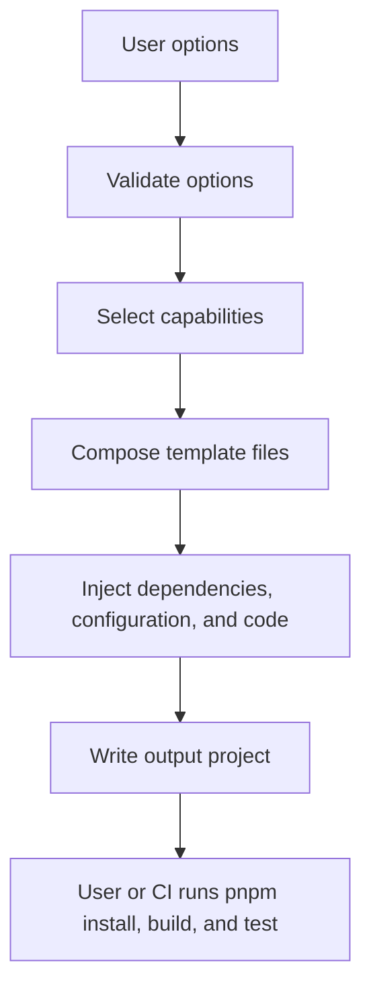
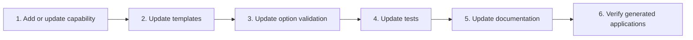

# React Template

A minimal React, TypeScript, and Vite template with an option contract that
generates only selected capabilities. The project avoids unused dependencies,
unused source code, and forced frontend architecture.

## Status

Version `1.0.0` is a maintained generator baseline with automated repository,
generated-build, accessibility, bundle, dependency, and container checks. These
checks validate the documented configurations; they are not certification that
every generated application is production-ready. Generated applications remain
application-owned and require review for their deployment and security context.

## Generate an application

```bash
pnpm run generate -- my-app --uiLibrary=shadcn
```

Flags use `--option=value`; omitted options use the documented defaults. See
the [option contract](docs/engineering/OPTION_CONTRACT.md) for all values and
validation rules.

## Documentation

- Start with the [documentation index](docs/README.md).
- Follow the [getting-started guide](docs/GETTING_STARTED.md).
- Review [capabilities](docs/CAPABILITIES.md) and
  [testing and deployment](docs/TESTING_AND_DEPLOYMENT.md).
- Use the [engineering standards](docs/engineering/README.md) for normative
  project contracts.

## Design direction

- React, TypeScript, and Vite form the minimal core.
- Routing, API access, styling, UI systems, authentication, and authorization
  are explicit options.
- Disabled options contribute no dependencies, configuration, source, or tests.
- Invalid option combinations fail generation instead of producing partial code.

See the eight-milestone [roadmap](ROADMAP.md) for delivery scope.

## How it works

The generator validates the complete option set before writing files. It then
composes only the selected capability templates, dependencies, configuration,
source code, and tests into a new project.



Validation failures stop generation before output is written. The generator
does not install packages or execute generated-project checks automatically.

### Why the generator uses `.mjs`

- Native ES modules run directly in supported Node.js versions.
- No generator compilation step is required.
- No TypeScript runtime or loader dependency is required.
- The format keeps scripting and code-generation entry points explicit.

### Example output

The exact files depend on the selected capabilities. A typical generated
project has this shape:

```text
my-app/
├── e2e/                  # only with testing=e2e
├── src/
├── components.json       # only with uiLibrary=shadcn
├── index.html
├── package.json
├── tsconfig.json
└── vite.config.ts
```

Optional directories are generated only when their owning capability is
selected.

### Adding a feature to the template



Each change must preserve the option contract: a disabled capability generates
no unused dependencies, files, imports, configuration, or tests. Maintainers
should follow the detailed [generator architecture](docs/engineering/GENERATOR_ARCHITECTURE.md)
and [contribution rules](CONTRIBUTING.md).

### Can capabilities be installed later?

There are two possible models:

1. **Create-time generation — current and recommended.** Options are resolved
   once, before files are written. This model is deterministic, easy to test,
   and avoids modifying application-owned code after generation.
2. **Post-generation installation — not currently supported.** Adding a
   capability safely to an existing application would require source analysis,
   dependency updates, file merging, import insertion, route updates, and
   conflict handling. A reliable implementation would normally use codemods or
   AST transforms and would need a separate compatibility and migration
   contract.

The generated application is owned by its consuming project. Until a supported
post-generation model exists, add capabilities manually or regenerate into an
empty directory and review the resulting diff.

## Contributing and support

- Read [CONTRIBUTING.md](CONTRIBUTING.md) before proposing changes.
- Report vulnerabilities according to [SECURITY.md](SECURITY.md).
- Use [SUPPORT.md](SUPPORT.md) for usage questions.
- Project behavior is governed by the [Code of Conduct](CODE_OF_CONDUCT.md).

## License

Licensed under the [MIT License](LICENSE).
