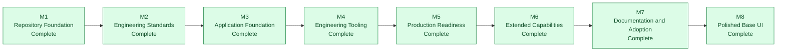
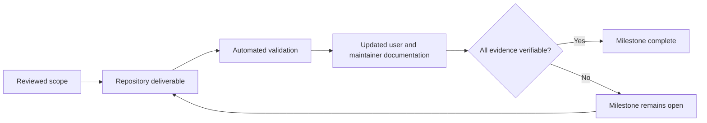

# Roadmap

The roadmap is a sequence of verifiable decision gates. A milestone is complete
only when its evidence is present in the repository and enforced by validation.

## Milestone evidence

```mermaid
flowchart TB
  M1["M1 · Repository Foundation"] --> E1["License · governance · contribution templates<br/>Markdown lint · link validation"]
  M2["M2 · Engineering Standards"] --> E2["Philosophy · option contract · compatibility policy<br/>Structure · coding and documentation conventions"]
  M3["M3 · Application Foundation"] --> E3["React · TypeScript · Vite core<br/>Selected capabilities only · contract tests · v1.0.0 baseline"]
  M4["M4 · Engineering Tooling"] --> E4["ESLint · Prettier · CI · Docker<br/>Default · minimal · maximum generation coverage"]
  M5["M5 · Production Readiness"] --> E5["Test layers · bundle budget · audit · accessibility<br/>Environment validation · error boundaries · deployment smoke"]
  M6["M6 · Extended Capabilities"] --> E6["Opt-in data · forms · table · theme · i18n<br/>Charts · upload · templates · API contracts"]
  M7["M7 · Documentation and Adoption"] --> E7["Getting started · CLI · options · architecture<br/>Testing · deployment · release · migration guides"]
  M8["M8 · Polished Base UI"] --> E8["Responsive accessible output · consistent states<br/>Optional themes · browser validation · stable release"]

  classDef milestone fill:#e0f2fe,stroke:#0369a1,color:#0c4a6e;
  classDef evidence fill:#f8fafc,stroke:#64748b,color:#0f172a;
  class M1,M2,M3,M4,M5,M6,M7,M8 milestone;
  class E1,E2,E3,E4,E5,E6,E7,E8 evidence;
```

## Completion gate

Future scope must be added as a new reviewed milestone. Existing milestones must
not be reopened solely to attach unrelated product features.
